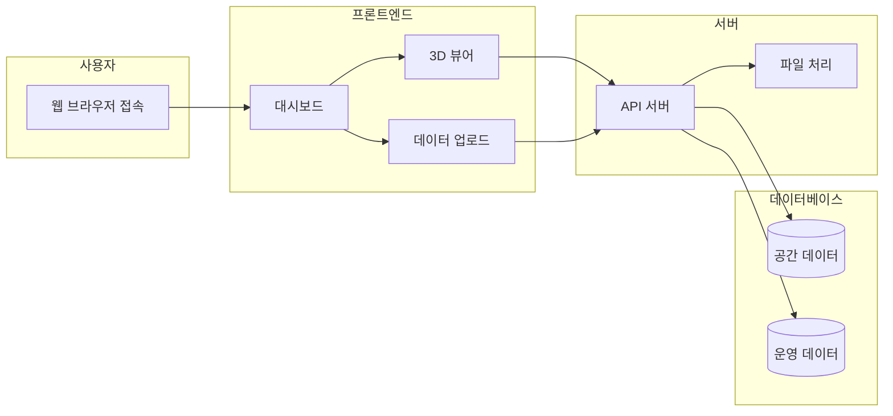
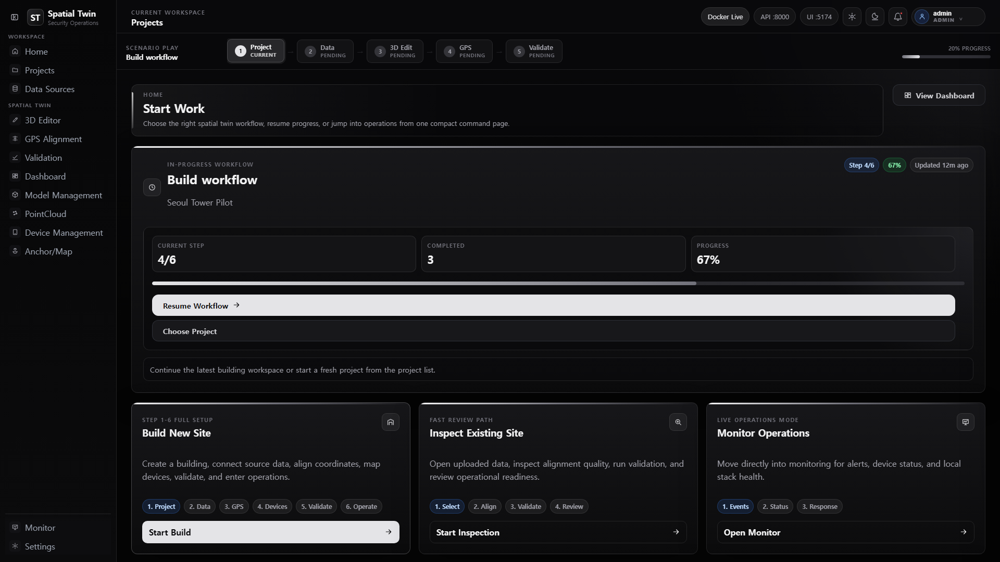
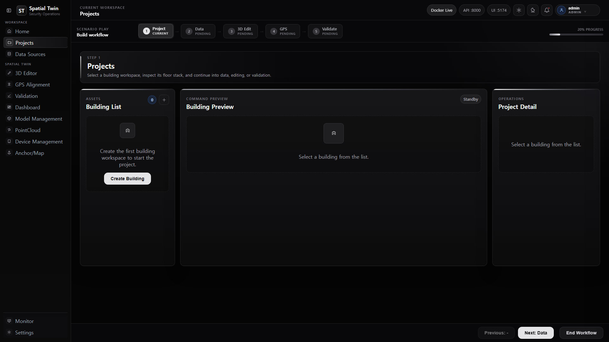
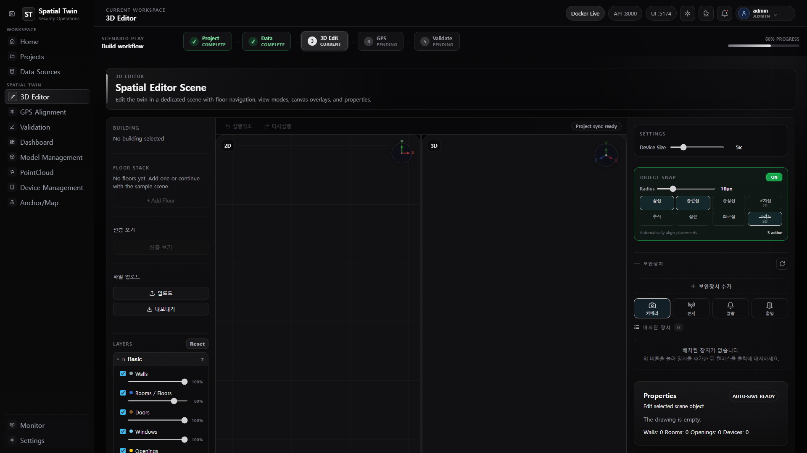

# Spatial Twin Platform

> **건물과 시설물 데이터를 디지털로 재현하고, 한 화면에서 공간 상태를 관리할 수 있는 플랫폼입니다.**

실제 건물의 구조, 설비, 센서 데이터를 웹 브라우저에서 3D로 확인하고 관리할 수 있습니다.
도면 업로드부터 GPS 좌표 정합, 실시간 모니터링까지 공간 디지털 트윈의 전체 흐름을 구현했습니다.

---

## 이 프로젝트가 해결하는 문제

| 문제 | 기존 방식 | 이 플랫폼의 해결책 |
|------|----------|-------------------|
| 건물 구조 파악 어려움 | 종이 도면, Excel, 메일로 정보 공유 | 3D 뷰어에서 건물/층/방 구조를 직관적으로 탐색 |
| 데이터 분산 | 센서, CCTV, 시설물 정보가 각각 다른 시스템에 흩어짐 | 한 화면에서 공간 + 시설 + 운영 데이터 통합 관리 |
| 좌표 불일치 | 현장 GPS 좌표와 도면 좌표가 다름 | 3점 정합으로 GPS ↔ 도면 좌표 자동 변환 |
| 유지보수 비효율 | 시설물 위치·상태 추적 어려움 | 보안장비 배치, 워크플로우 진행 상태 실시간 확인 |

---

## 주요 기능

| 기능 | 설명 | 기대 효과 |
|------|------|----------|
| **건물/층 관리** | 건물 생성, 층 추가/수정/삭제, 지도·공간 설정 | 건물 구조를 체계적으로 관리 |
| **데이터 업로드** | CAD(DXF/DWG), IFC, 3D 모델(GLB), PointCloud 업로드 | 다양한 도면/모델 파일 통합 관리 |
| **2D/3D 뷰어** | 도면 위에서 벽·방·문·창 편집, 3D 건물 렌더링 | 공간 구조를 입체적으로 확인 |
| **GPS/OSM 정렬** | 3개 기준점으로 로컬 좌표 ↔ 실제 위경도 변환 | 도면과 실제 위치를 정확히 일치 |
| **보안장비 배치** | 카메라, 센서 등 보안 설비 CRUD | 시설물 위치·상태 한눈에 파악 |
| **프로젝트 관리** | 스냅샷 저장, 자산 배치, 워크플로우 진행 추적 | 프로젝트 진행 상황을 투명하게 관리 |
| **내보내기** | DXF, CSV, 패키지 형태로 데이터 export | 외부 시스템과 데이터 공유 |
| **실시간 모니터링** | WebSocket 기반 이벤트 수신 | 현장 상황을 실시간으로 확인 |

---

## 작동 방식

아래 다이어그램은 사용자가 플랫폼을 사용할 때 데이터가 흐르는 경로를 보여줍니다.



### 시스템 구성 요소

| 요소 | 역할 | 비유 |
|------|------|------|
| **프론트엔드** | 사용자가 보고 조작하는 화면 | 자동차의 계기판과 핸들 |
| **API 서버** | 화면과 데이터 사이의 중계자 | 심장이 혈액을 순환시키듯 데이터를 전달 |
| **데이터베이스** | 공간/시설/사용자 정보 저장 | 도서관의 자료실 |
| **파일 처리** | CAD, 3D 모델, PointCloud 변환 | 번역기가 외국어를 한국어로 바꾸듯 파일을 변환 |
| **캐시(Redis)** | 자주 쓰는 데이터를 빠르게 저장 | 자주 쓰는 도서를 책상 위에 올려놓은 것 |

---

## 기술 스택

| 기술 | 설명 | 왜 이 기술을 선택했는지 |
|------|------|------------------------|
| **React** | 사용자 인터페이스를 만드는 도구 | 빠르고 유연한 화면 구성, 커뮤니티 활발 |
| **Three.js** | 3D 그래픽을 웹에서 보여주는 도구 | 건물/공간을 입체적으로 시각화하기 위해 |
| **FastAPI** | 서버 API를 빠르게 만드는 Python 프레임워크 | 고성능, 자동 문서 생성, 타입 안정성 |
| **PostgreSQL + PostGIS** | 공간 데이터를 저장·관리하는 데이터베이스 | GIS(지리정보) 데이터를 원본으로 지원 |
| **Redis** | 임시 데이터를 빠르게 저장하는 캐시 | 반복 요청에 빠르게 응답하기 위해 |
| **Docker** | 앱과 데이터베이스를 패키지로 묶는 도구 | "내 컴퓨터에서만 되던" 문제를 해결 |

---

## UI 스크린샷

### 메인 대시보드

홈 화면에서 워크플로우를 선택하고 진행 상황을 한눈에 확인할 수 있습니다.



| 영역 | 설명 |
|------|------|
| **좌측 네비게이션** | 워크스페이스, 3D 에디터, GPS 정렬 등 주요 기능 바로가기 |
| **워크플로우 스텝** | 프로젝트 → 데이터 → 3D 편집 → GPS → 검증 단계 표시 |
| **진행 중인 워크플로우** | 이전 작업 재개 또는 새 프로젝트 시작 |
| **환경 상태** | Docker, API, UI 포트 실시간 상태 표시 |

### 프로젝트 관리

건물 워크스페이스를 생성하고 관리하는 화면입니다.



| 영역 | 설명 |
|------|------|
| **건물 목록** | 생성된 건물 워크스페이스 목록과 새로 만들기 |
| **건물 미리보드** | 선택한 건물의 층 구조 미리보기 |
| **프로젝트 상세** | 건물 상세 정보와 워크플로우 진행 상태 |

### 3D 에디터

도면 위에서 벽, 방, 문, 창문을 편집하고 3D로 시각화하는 에디터입니다.



| 영역 | 설명 |
|------|------|
| **2D 뷰포트** | 도면 위에서 벽/방/문/창 편집 (그리드, 스냅 지원) |
| **3D 뷰포트** | 편집 결과를 실시간 3D로 확인 |
| **레이어 패널** | 벽, 방, 문, 창 등 요소별 표시/숨김 제어 |
| **보안 장비** | 카메라, 센서 등 보안 설비 배치 |
| **스냅 설정** | 끝점/중점/교차점 등 정밀 스냅 옵션 |

---

## 빠르게 실행하기

### 사전 준비

- [Git](https://git-scm.com/) 설치
- [Docker Desktop](https://www.docker.com/products/docker-desktop/) 설치

### 방법 1: Docker로 한 번에 실행 (추천)

```bash
# 프로젝트 복사
git clone https://github.com/your-username/spatial-twin-platform.git
cd spatial-twin-platform/workspace

# 전체 실행
docker compose up -d --build
```

실행 완료 후 브라우저에서 접속:

| 화면 | 주소 |
|------|------|
| **메인 화면** | http://localhost:5174 |
| **API 문서** | http://localhost:8000/docs |

### 방법 2: 개발자용 수동 실행

<details>
<summary>수동 실행 상세 방법 (클릭)</summary>

```bash
# 1. 데이터베이스 실행
cd workspace
docker compose up -d postgres redis

# 2. 백엔드 실행
cd backend
python -m venv .venv
.\.venv\Scripts\Activate.ps1    # Windows
# source .venv/bin/activate     # macOS/Linux
pip install -r requirements.txt
python -m pytest
uvicorn app.main:app --reload --port 8000

# 3. 프론트엔드 실행
cd ../frontend
npm install
npm run test
npm run build
npm run dev
```

| 화면 | 주소 |
|------|------|
| 프론트엔드 | http://localhost:5173 |
| 백엔드 API | http://localhost:8000/docs |

</details>

---

## 데모 계정

인증이 활성화된 경우 다음 계정으로 로그인할 수 있습니다:

| 역할 | 아이디 | 비밀번호 | 권한 |
|------|--------|----------|------|
| 관리자 | admin | admin123 | 전체 기능 접근 |
| 매니저 | manager | manager123 | 건물/시설 관리 |
| 편집자 | editor | editor123 | 편집 및 업로드 |
| 뷰어 | viewer | viewer123 | 조회만 가능 |

> 참고: 개발 환경에서는 인증이 기본적으로 꺼져 있어 바로 접근할 수 있습니다.

---

## 용어 사전

| 용어 | 설명 |
|------|------|
| **디지털 트윈** | 실제 건물이나 공간을 컴퓨터 화면에 동일하게 재현한 것. 마치 실제 건물의 "쌍둥이"를 만드는 것 |
| **도면** | 건물의 평면을 위에서 내려다본 그림. 벽, 문, 창문의 위치를 나타냄 |
| **Point Cloud** | 레이저 스캐너로 측정한 수백만 개의 점으로 이루어진 3D 데이터. 실제 공간의 정밀한 모양을 담고 있음 |
| **API** | 프로그램끼리 데이터를 주고받는 약속된 통로. 비유하자면 "주문서"와 같다 |
| **GPS 정렬** | 도면상의 좌표와 실제 위경도 좌표를 일치시키는 작업 |
| **프레임워크** | 프로그램을 만들 때 기본 틀이 되는 도구. 비유하자면 "건축 자재 패키지" |
| **데이터베이스** | 구조화된 정보를 저장하고 관리하는 시스템. 비유하자면 "전자 파일 서랍" |
| **WebSocket** | 서버와 브라우저가 실시간으로 데이터를 주고받는 통신 방식. 채팅처럼 끊김 없이 대화하는 것 |
| **MVP** | 최소 기능만으로 핵심 가치를 검증하는 초기 버전 |

---

## 학습 포인트 / 성과

### 기술적 도전과 해결

| 도전 | 해결 방식 |
|------|----------|
| CAD 파일에서 벽·방·문·창 정보 추출 | `ezdxf` 라이브러리로 DXF 파싱, geometry 자동 추출 |
| PointCloud → 3D 메시 변환 | Open3D의 Poisson surface reconstruction 활용 |
| GPS 좌표와 도면 좌표 정합 | 3점 이상의 기준점으로 affine transform 계산 |
| 실시간 모니터링 | WebSocket 기반 heartbeat/echo 구현 |
| 다양한 파일 포맷 지원 | 파일 유형별 파이프라인 분리, 확장 가능한 업로드 구조 |

### 아키텍처 학습

- **API 중심 설계**: 프론트엔드와 백엔드를 API로 분리하여 각각 독립적으로 확장 가능
- **상태 관리**: Zustand로 복잡한 에디터 상태를 효율적으로 관리
- **공간 데이터 처리**: PostGIS를 활용한 공간 쿼리와 좌표 변환
- **파이프라인 패턴**: 업로드 → 처리 → 저장 흐름을 단계적으로 분리

---

## 프로젝트 구조

```
workspace/
├── backend/           # 서버 (Python + FastAPI)
│   ├── app/
│   │   ├── routers/   # API 엔드포인트 (데이터 통로)
│   │   ├── services/  # 비즈니스 로직 (데이터 처리)
│   │   ├── models.py  # 데이터 구조 정의
│   │   └── main.py    # 서버 시작점
│   ├── tests/         # 자동 테스트
│   └── alembic/       # 데이터베이스 변경 이력
└── frontend/          # 화면 (React + TypeScript)
    └── src/
        ├── pages/     # 각 화면 컴포넌트
        ├── components/ # 재사용 가능한 UI 조각
        ├── api/       # 서버 통신 모듈
        └── stores/    # 화면 상태 관리
```

---

## 테스트

이 프로젝트는 안정성을 위해 자동 테스트를 포함하고 있습니다:

| 테스트 유형 | 명령어 | 설명 |
|-------------|--------|------|
| 백엔드 단위 테스트 | `pytest -v` | API 기능 동작 검증 |
| 프론트엔드 단위 테스트 | `npm run test` | 화면 컴포넌트 동작 검증 |
| 브라우저 테스트 | `npm run e2e` | 실제 브라우저에서 전체 흐름 검증 |

---

## 향후 개선 방향

- **실시간 알림**: 센서 이상 감지 시 자동 알림
- **권한별 대시보드**: 역할에 따라 볼 수 있는 화면 차별화
- **더 많은 파일 포맷**: IFC, Revit 등 건축 파일 추가 지원
- **모바일 대응**: 현장에서 스마트폰으로 접근 가능하도록 반응형 UI
- **운영 분석**: 공간 활용도, 시설물 상태 추이 등의 대시보드

---

## 라이선스

이 프로젝트는 학습 및 포트폴리오 목적으로 제작되었습니다.
